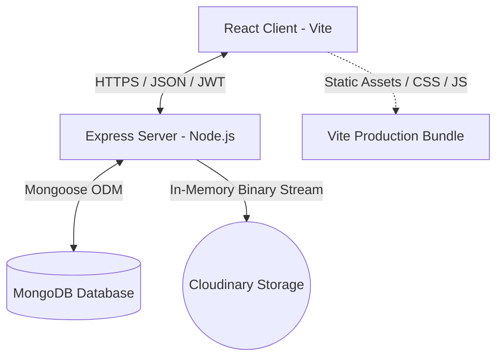
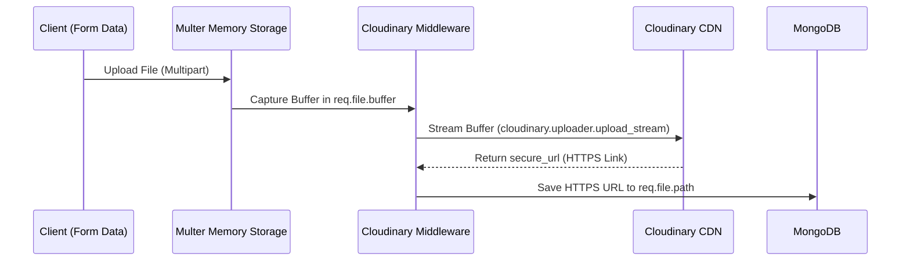

# ✍️ BlogSphere — Complete Platform Documentation & Architectural Guide

Welcome to the official, comprehensive technical documentation for **BlogSphere**, a state-of-the-art full-stack magazine and blog publication platform built using the MERN (MongoDB, Express, React, Node.js) architecture.

This document serves as an exhaustive guide covering the system from scratch to its inner details, including database schemas, backend cloud pipeline configurations, custom theme overrides, advanced layout grouping strategies, environment settings, and installation workflows.

---

## 📌 Table of Contents
1. [Executive Summary & Branding](#1-executive-summary--branding)
2. [High-Level System Architecture](#2-high-level-system-architecture)
3. [Technology Stack Breakdown](#3-technology-stack-breakdown)
4. [Database Modeling & Schema Architecture](#4-database-modeling--schema-architecture)
5. [In-Depth Feature Catalog](#5-in-depth-feature-catalog)
6. [Cloudinary Upload Pipeline Details](#6-cloudinary-upload-pipeline-details)
7. [Persistent Dark Mode System & Custom Overrides](#7-persistent-dark-mode-system--custom-overrides)
8. [Advanced UI, Layout, & Spacing Optimization](#8-advanced-ui-layout--spacing-optimization)
9. [Authentication & Security Policies](#9-authentication--security-policies)
10. [API Route Specifications & Testing References](#10-api-route-specifications--testing-references)
11. [Installation, Configuration, & Seeding Guide](#11-installation-configuration--seeding-guide)
12. [Vite Production Bundler & Asset Delivery](#12-vite-production-bundler--asset-delivery)
13. [Core Upgrades Log (Chronological Roadmap)](#13-core-upgrades-log-chronological-roadmap)

---

## 1. Executive Summary & Branding

### The Concept
**BlogSphere** is a premium, publication-focused social writing platform. Designed to reflect real-world content management workflows, it bridges the gap between basic minimum viable products and commercial-grade applications like Medium, Hashnode, or Substack.

### Brand Identity
* **Logo Branding**: Represented throughout the interface by the `✍️ BlogSphere` mark, rendered with customized gradients shifting from slate-900 to indigo-950 in light mode, and a pure white-to-indigo gradient in dark mode.
* **Typographic Signature**: Leverages the premium **Plus Jakarta Sans** Google Font, giving all titles, body typography, and input structures a highly visual, clean, and publication-ready finish.
* **Design Philosophy**: Glassmorphism, smooth micro-transitions, harmonized color spectrums, clear outline buttons, and persistent class-based light/dark configurations.

---

## 2. High-Level System Architecture



The system operates on an isolated, decoupled architecture:
1. **Frontend Layer (Vite + React)**: Serves a Single Page Application (SPA) driven by React Router. All styling is rendered dynamically using Tailwind CSS compiled utility scopes. It handles visual states, cached user sessions (`localStorage`), and coordinates secure API calls to the server.
2. **Backend Services Layer (Express + Node.js)**: Governs business logic, data sanitization, security middleware, authentication flows, database transactions, and cloud upload streaming. It features full **Express 5** compatibility.
3. **Storage Layer (MongoDB + Cloudinary)**:
   * **Structured Data**: MongoDB houses relational-like documents for Users, Blog Posts, and Comments.
   * **Media Delivery**: Cloudinary manages and delivers cloud-optimized image resources over a secure CDN, removing filesystem constraints.

---

## 3. Technology Stack Breakdown

### Frontend Core
* **React (v18.3.1)**: Utilizes functional components, hooks (`useState`, `useEffect`, `useContext`), and custom Providers for state distribution.
* **Tailwind CSS (v3.4.19)**: Implements utilities, custom components, typography configurations, and a class-based dark mode design matrix.
* **React Quill (v2.0.0)**: Powers the rich-text editing engine, providing responsive text formatting, lists, quotes, and structural block tags.
* **Axios (v1.13.2)**: Configured with interceptors to inject JWT authorization bearer headers and safely catch/handle server-side responses.
* **React Router Dom (v7.12.0)**: Manages clean, client-side SPA routing, including wildcards and route protections.

### Backend Infrastructure
* **Node.js (v22+)**: Runtime environment utilizing modern ES modules.
* **Express.js (v5.2.1)**: Fast, minimalist web framework utilizing the latest version to handle named wildcards and middleware chaining.
* **Mongoose (v8.9.5)**: Structured schema modeling interface for MongoDB.
* **Multer (v1.4.5-lts.1)**: Configured for strict in-memory parsing of multipart/form-data.
* **Cloudinary SDK (v2.5.1)**: Manages secure CDN uploads via stream helpers.
* **JWT (JSON Web Tokens)**: Secures API paths via cryptographically signed payloads.
* **Bcrypt (v5.1.1)**: Salts and hashes credentials securely before storage.

---

## 4. Database Modeling & Schema Architecture

MongoDB stores data under three primary schemas, configured with cross-referencing relations (Mongoose `ObjectId` population).

### 👤 User Schema
Maintains writer profiles, access credentials, and lifecycle timestamps.

```javascript
const userSchema = new mongoose.Schema({
  name: { type: String, required: true, trim: true },
  email: { type: String, required: true, unique: true, lowercase: true, trim: true },
  password: { type: String, required: true },
}, { timestamps: true });
```

### 📝 Post Schema
Houses draft and published content, categories, and references the author and likes arrays.

```javascript
const postSchema = new mongoose.Schema({
  title: { type: String, required: true, trim: true },
  content: { type: String, required: true },
  category: { 
    type: String, 
    required: true, 
    enum: ["Technology", "Lifestyle", "Business", "Health", "Others"] 
  },
  image: { type: String }, // Stores Cloudinary HTTPS CDN URL
  status: { type: String, enum: ["draft", "published"], default: "draft" },
  author: { type: mongoose.Schema.Types.ObjectId, ref: "User", required: true },
  likes: [{ type: mongoose.Schema.Types.ObjectId, ref: "User" }]
}, { timestamps: true });
```

### 💬 Comment Schema
Stores feedback under specific posts, referencing both the writer and the target article.

```javascript
const commentSchema = new mongoose.Schema({
  content: { type: String, required: true, trim: true },
  post: { type: mongoose.Schema.Types.ObjectId, ref: "Post", required: true },
  author: { type: mongoose.Schema.Types.ObjectId, ref: "User", required: true },
}, { timestamps: true });
```

---

## 5. In-Depth Feature Catalog

### A. Real-World Publication Workflow
* **Draft Canvas**: Newly written posts are saved as `draft` status by default. Draft posts are strictly isolated and are only visible to the original author within their private Writer Profile.
* **One-Click Publishing**: The author can click "Publish" inside their profile to switch the post's status to `published`. This actions index compiling, making the article instantly visible on the public homepage.
* **Dynamic Editing**: Authors can update titles, change featured images, edit HTML body contents, and swap categories at any point.

### B. Intelligent Search & Filters
* **Search Engine**: Features a regex-supported search query endpoint matching terms against post titles or rich contents, filtering exclusively within `published` posts.
* **Category Matrix**: Visually classifies articles into colorful pills (Technology, Lifestyle, Business, Health, and others), allowing readers to parse themes quickly.

### C. Public Engagement Suite
* **Persistent Hearts**: Readers can "like" published posts. The system tracks liking `UserIds` in an array, allowing toggling (like/unlike) with immediate UI metric updates.
* **Live Discussions**: Dynamic comment threads are appended to article detail views. Anyone logged in can contribute. Deletion locks are in place: a user can only delete comments that they wrote.

---

## 6. Cloudinary Upload Pipeline Details

To avoid local filesystem write issues and prepare the app for seamless, stateless serverless hosting (e.g. Vercel), the upload system was upgraded from local Multer disk-saving to an in-memory Cloudinary streaming pipeline.



### The Upload Middleware Code (`server/middleware/upload.js`)
```javascript
import multer from "multer";
import { v2 as cloudinary } from "cloudinary";
import dotenv from "dotenv";

dotenv.config();

// Initialize Cloudinary with API Credentials
cloudinary.config({
  cloud_name: process.env.CLOUDINARY_CLOUD_NAME,
  api_key: process.env.CLOUDINARY_API_KEY,
  api_secret: process.env.CLOUDINARY_API_SECRET,
});

// Configure Multer for In-Memory temporary storage
const storage = multer.memoryStorage();
const upload = multer({ storage });

// Async Middleware to stream buffer directly to Cloudinary API
const handleCloudinaryUpload = async (req, res, next) => {
  if (!req.file) return next();

  // Safeguard: Check if Cloudinary environment is configured
  if (!process.env.CLOUDINARY_CLOUD_NAME) {
    return res.status(500).json({ 
      message: "Cloudinary settings missing in server/.env file" 
    });
  }

  try {
    const uploadStream = cloudinary.uploader.upload_stream(
      { folder: "blogsphere" },
      (error, result) => {
        if (error) {
          console.error("Cloudinary upload error:", error);
          return res.status(500).json({ message: "Cloud upload failed" });
        }
        // Bind the secure HTTPS CDN link to req.file.path
        req.file.path = result.secure_url;
        next();
      }
    );
    uploadStream.end(req.file.buffer);
  } catch (err) {
    console.error("Upload pipeline failed:", err);
    res.status(500).json({ message: "Internal upload pipeline error" });
  }
};

export { upload, handleCloudinaryUpload };
```

---

## 7. Persistent Dark Mode System & Custom Overrides

BlogSphere features a class-based Dark/Light theme toggler driven by a unified React Context. It caches choices inside `localStorage` and applies the theme class to the global document.

### A. Default Boot to Dark Mode (`ThemeContext.jsx`)
To deliver a high-end first impression, the app defaults to `dark` mode on initial boot (when local storage is empty):

```javascript
export function ThemeProvider({ children }) {
  const [theme, setTheme] = useState(() => {
    return localStorage.getItem("theme") || "dark";
  });
  
  useEffect(() => {
    const root = window.document.documentElement;
    if (theme === "dark") {
      root.classList.add("dark");
    } else {
      root.classList.remove("dark");
    }
    localStorage.setItem("theme", theme);
  }, [theme]);
  // ...
}
```

### B. ReactQuill Rich-Editor Theme Skinning
Because the Quill rich editor loads its own stylesheets, it can display stark white input panels in dark mode. I have injected target class overrides inside `client/src/index.css` to force the editor to conform to dark mode:

```css
/* ReactQuill Dark Mode Custom Overrides */
html.dark .ql-toolbar.ql-snow {
  background-color: #0f172a !important; /* slate-900 */
  border-color: #1e293b !important; /* slate-800 */
  color: #e2e8f0 !important;
}
html.dark .ql-toolbar.ql-snow .ql-stroke {
  stroke: #94a3b8 !important; /* slate-400 */
}
html.dark .ql-toolbar.ql-snow .ql-fill {
  fill: #94a3b8 !important; /* slate-400 */
}
html.dark .ql-toolbar.ql-snow .ql-picker {
  color: #e2e8f0 !important;
}
html.dark .ql-toolbar.ql-snow .ql-picker-options {
  background-color: #0f172a !important;
  border-color: #1e293b !important;
}
html.dark .ql-container.ql-snow {
  background-color: #0b0f19 !important;
  border-color: #1e293b !important;
}
html.dark .ql-editor {
  color: #f1f5f9 !important;
  font-family: 'Plus Jakarta Sans', sans-serif !important;
}
```

---

## 8. Advanced UI, Layout, & Spacing Optimization

### A. Grouped Navbar Spacing (`Navbar.jsx`)
To fix loose, awkward spacing, the desktop navbar layout separates functional groups into discrete sub-containers, grouping action elements together:

```jsx
{/* Desktop Menu */}
<div className="hidden md:flex items-center gap-6 text-sm font-semibold tracking-wide">
  <div className="flex items-center gap-5">
    <NavLink to="/" className="nav-link">Home</NavLink>
    {user && <NavLink to="/create" className="nav-link">Create</NavLink>}
    {user && <NavLink to={`/profile/${user.id}`} className="nav-link">Profile</NavLink>}
  </div>

  {/* Theme Toggle in the center */}
  <button onClick={toggleTheme} className="...">...</button>

  {/* Auth buttons closely paired together */}
  <div className="flex items-center gap-2.5 ml-1">
    {!user && <NavLink to="/login" className="btn-outline-indigo">Login</NavLink>}
    {!user && <NavLink to="/register" className="btn-indigo">Register</NavLink>}
    {user && <button onClick={logout} className="btn-outline-red">Logout</button>}
  </div>
</div>
```

### B. Premium Typography Engine (`.blog-content`)
To prevent Tailwind's base stylesheet reset from collapsing headers, paragraphs, and list items into standard unspaced text blocks inside detail pages, we implement custom blog-specific overrides:

```css
.blog-content {
  @apply text-slate-700 dark:text-slate-300 leading-relaxed text-base sm:text-lg;
}
.blog-content p {
  @apply mb-6 font-normal;
}
.blog-content h1 {
  @apply text-3xl sm:text-4xl font-extrabold text-slate-900 dark:text-white mt-10 mb-5 tracking-tight;
}
.blog-content h2 {
  @apply text-2xl sm:text-3xl font-bold text-slate-900 dark:text-white mt-8 mb-4 tracking-tight;
}
.blog-content ul {
  @apply list-disc pl-6 mb-6 space-y-2 text-slate-700 dark:text-slate-300;
}
.blog-content ol {
  @apply list-decimal pl-6 mb-6 space-y-2 text-slate-700 dark:text-slate-300;
}
.blog-content blockquote {
  @apply border-l-4 border-indigo-500 bg-slate-50 dark:bg-slate-900/30 pl-5 pr-4 py-3 my-6 italic text-slate-600 dark:text-slate-400 rounded-r-xl;
}
```

---

## 9. Authentication & Security Policies

* **Cryptographic Passwords**: Leverages `bcrypt` with a salting factor of `10` to hash all credentials before storage.
* **Token Access (JWT)**: Signs user details (`id` and `name`) using a secure backend secret, delivering stateless tokens with standard expiration durations.
* **Router Protection Middleware**: Protects API routes via Express authorization middleware:
  ```javascript
  const protect = async (req, res, next) => {
    let token = req.headers.authorization?.split(" ")[1];
    if (!token) return res.status(401).json({ message: "Not authorized, no token" });
    try {
      const decoded = jwt.verify(token, process.env.JWT_SECRET);
      req.user = await User.findById(decoded.id).select("-password");
      next();
    } catch {
      res.status(401).json({ message: "Not authorized, token failed" });
    }
  };
  ```
* **Axios Interceptor Safeguards**: Avoids endless page reloads on bad inputs by preventing Axios 401 response interceptors from triggering on requests made to the authentication `/auth/login` endpoint itself.

---

## 10. API Route Specifications & Testing References

All route endpoints are served relative to the backend base URL (e.g. `http://localhost:5000/api`).

### 🔑 Authentication Routes
* `POST /auth/register`: Creates a new account.
  * *Request Body*: `{ "name": "John", "email": "john@test.com", "password": "password123" }`
* `POST /auth/login`: Authenticates credentials.
  * *Request Body*: `{ "email": "john@test.com", "password": "password123" }`
  * *Response*: Returns JSON user details and JWT Token signature.

### 📝 Post Routes
* `POST /posts`: Create a new draft. Requires standard authorization headers and multi-part files for images.
* `PATCH /posts/:id/status`: Publishes an existing draft post. (Author-locked).
* `GET /posts`: Returns array of published posts.
* `GET /posts/my`: Returns author's private draft and published posts. (Requires JWT).
* `GET /posts/search?q=query`: Searches posts.
* `PUT /posts/:id`: Updates an existing post. (Author-locked).

### 💬 Discussion Routes
* `GET /comments/:postId`: Fetches all discussion comments for a post.
* `POST /comments/:postId`: Appends a comment to a post. (Requires JWT).
* `DELETE /comments/:commentId`: Deletes a comment. (Author-locked).

---

## 11. Installation, Configuration, & Seeding Guide

### Step 1: Clone and Set Up Environments
Clone your repository and navigate to the project directory:
```bash
git clone <repo-url>
cd Blog-Platform
```

Create the environments as specified in the [Environment Variables](#6-environment-variables) section.

### Step 2: Run Database Seeding
The project comes with a seeding script to populate collections with 5 users and 15 posts:
```bash
cd server
npm install
npm run seed
```
*(Ensure local MongoDB is active or Atlas connections are open).*

### Step 3: Run the Applications
Open two terminals or use background runners:
* **Terminal A (Server)**:
  ```bash
  cd server
  npm run dev
  ```
* **Terminal B (Client)**:
  ```bash
  cd client
  npm install
  npm run dev
  ```

Open `http://localhost:5173` inside your browser to access the live application!

---

## 12. Vite Production Bundler & Asset Delivery

When compiling BlogSphere for production environments (e.g. hosting on Vercel or Netlify), running `npm run build` inside the `client/` folder leverages Vite's rollup compiler:

1. **JavaScript Bundles**: Compiles ES modules, strips comments, and packs JS code into lightweight chunks (`dist/assets/index-[hash].js`).
2. **CSS Pipelines**: Evaluates Tailwind CSS classes, purges unused class names, processes custom base-layer overrides, and compiles a single compressed stylesheet (`dist/assets/index-[hash].css`).
3. **Favicon Assets**: Dynamically copies and bundles customized asset resources like `client/src/assets/fav.png` into clean assets.

---

## 13. Core Upgrades Log (Chronological Roadmap)

* **Cloudinary Storage**: Migrated disk storage writes to in-memory upload streaming pipelines, making deployments fully serverless compatible.
* **Rebranding to ✍️ BlogSphere**: Updated logos, metadata title records, headers, descriptions, and empty states.
* **Express 5 Wildcard Adaptations**: Shifted route catchalls from `*` to `/*splat` to comply with the Express 5 named-parameter syntax requirements.
* **Responsive Spacing Optimization**: paired desktop navigation bar actions closely together while grouping standard index pages cleanly.
* **Cohesive Midnight Dark Theme**: Setup default dark theme options (`localStorage`), overriding ReactQuill forms, inputs, selects, and text fields with gorgeous contrast levels.
* **Dynamic Article Typography**: Implemented custom `.blog-content` stylesheets, fixing collapsed headers, paragraphs, quotes, and list margins globally.
* **Favicon Integration**: Linked Vite index templates to target customized `fav.png` assets dynamically.

---
*Documentation drafted and validated for BlogSphere by Ritesh Kumar.*
